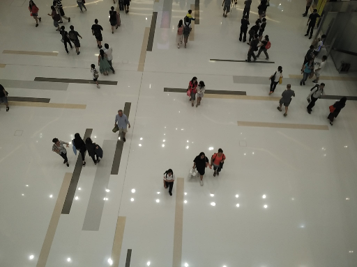
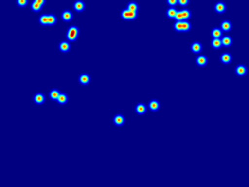
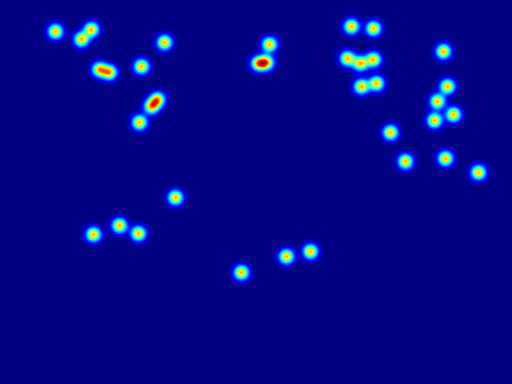
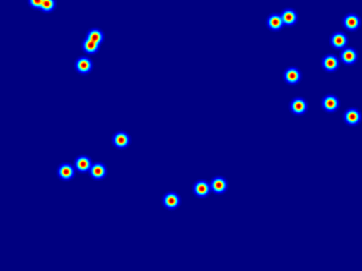
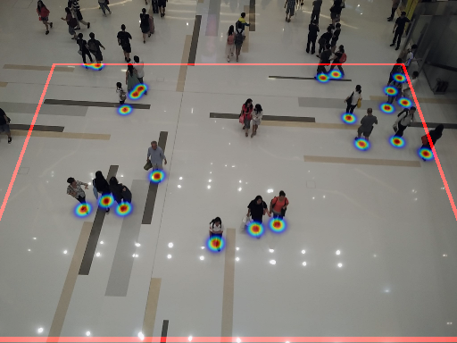

# CityUHK-X-BEV Dataset

This dataset is an extended dataset based on CityUHK-X dataset. 

Related paper: [BEV-Net](https://github.com/daizhirui/BEVNet)

The files can be loaded by using `h5py`. 

| Image | Head Map |Feet Map| BEV Map | BEV Back-Projected to IV |
|:-----:|:--------:|:------:|:-------:|:------------------------:|
||||||

# Available Data

- image
- bev\_center: the corresponding world coordinate of the BEV map center
- bev\_scale: the physical scale of the BEV map, unit: meter/pixel
- bev\_map: the density map of people in the bird's eye view
- bev\_coord: the coordinates of people in the BEV map
- head\_map: the density map of people's head in the image view
- head\_annotation: the annotation of people's head
- feet\_map: the density map of people's feet in the image view
- feet\_annotation: the annotation of the mid-point of people's feet
- world\_coord: the world coordinates of people
- num\_annotations: number of annotations in each image
- roi\_mask: mask of region of interest
- camera\_angle: camera pitch angle
- camera\_height: camera height relative to the ground plane
- camera\_fu: camera focal length (horizontal)
- camera\_fv: camera focal length (vertical)
